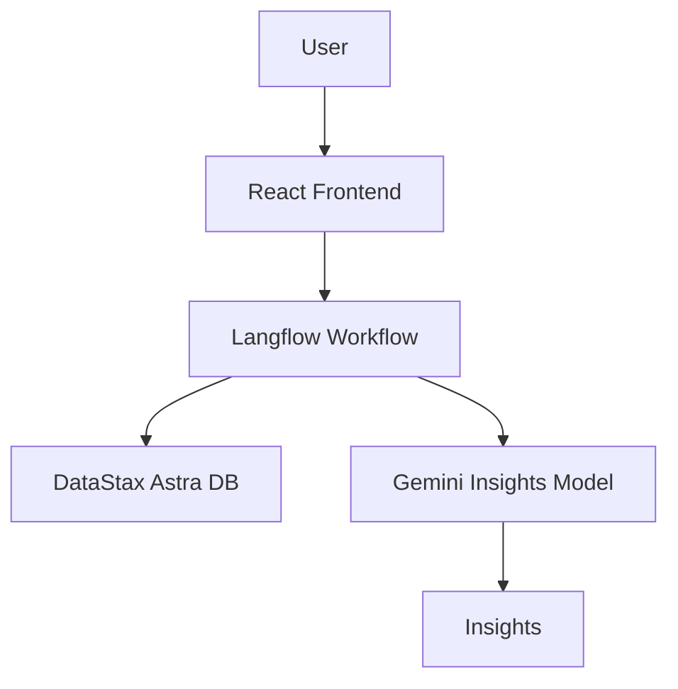

# Engagefy - Social Media Performance Analysis Platform 📊

## Overview
The **Engagefy** is a robust web application designed to evaluate and generate insights into social media engagement. With a focus on user experience, our platform empowers users to analyze their profiles and specific post types with precision and ease. 

### Key Features:
- **Frontend**: Developed using React for a seamless and interactive user interface.
- **Database**: DataStax Astra DB powers robust and efficient data storage and retrieval.
- **Workflow Creation**: Langflow integrates to manage workflows and GPT integration for insight generation.
- **Generative Model**: Gemini provides advanced insights by evaluating engagement metrics.
- **Third-Party Integration**: Anonymous Instagram data scraping using a secure API for profile and post-type analysis.

---

## Modified Features
We enhanced the original assignment with the following functionalities:
- **Profile Analysis**: Users can upload their profile name to analyze their overall performance.
- **Post-Specific Analysis**: Analyze engagement metrics for a particular type of post (carousel, reels, static images).

---

## Project Architecture

- The architecture connects the React frontend, DataStax DB, Langflow workflows, and Gemini insights generation.
- Add the architecture illustration here once finalized. You can use tools like Lucidchart or Figma for visual clarity.

---

## Technologies Used

| Component        | Technology/Tool       |
|------------------|-----------------------|
| **Frontend**     | React                |
| **Database**     | DataStax Astra DB    |
| **Workflow**     | Langflow             |
| **Insights**     | Gemini Model         |
| **API**          | Third-party Instagram Data Scraper |

---

## How It Works ✨

### Step-by-Step Description:
1. **Data Collection**:
   - The platform uses a third-party API to scrape the Instagram Profile Posts of the User.
   - Engagement data such as likes, comments, and shares are fetched.

2. **Data Storage**:
   - The scraped data is stored securely in **DataStax Astra DB (Non-Vector based)**, ensuring scalability and reliability.

3. **Workflow Management**:
   - **Langflow** is responsibel for the workflows, including data processing and integration with GPT model.

4. **Insights Generation**:
   - The **Gemini model** evaluates the metrics and generates actionable insights based on post types and user profiles.

5. **User Interaction**:
   - Users can upload their profile name as well as choose specific post types for analysis.
   - The platform displays engagement metrics and insights in an easy-to-read format.

---

## Example Insights 📊
- **Carousel Engagement**: Carousel posts have 20% higher engagement than static images.
- **Reels Performance**: Reels generate twice the comments compared to other post types.

---

## Installation Illustration 🛠️

---

## Contact 📬
For inquiries or support, contact:
- **Email**: support@socialmediaanalysis.com
- **GitHub Issues**: <repository-issues-link>

---

## Acknowledgments 🙌
- **Langflow** for workflow management.
- **DataStax** for robust database solutions.
- **Gemini** for generative insights.
- **Third-Party API** for enabling anonymous Instagram data scraping.

---
