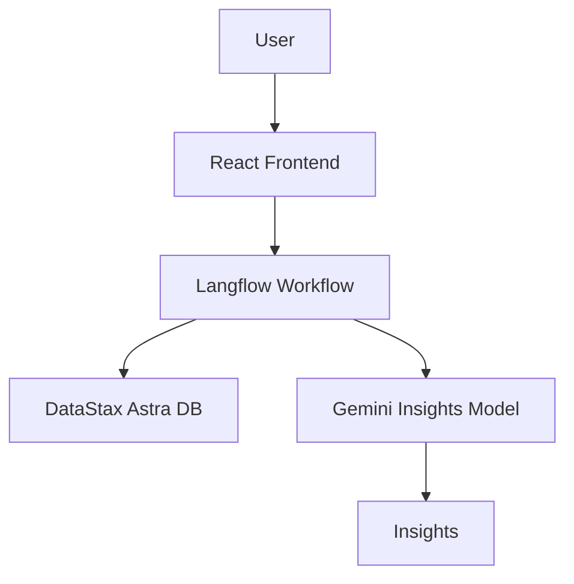

# Social Media Performance Analysis Platform

## Overview
The **Social Media Performance Analysis Platform** is a robust web application designed to evaluate and generate insights into social media engagement. With a focus on user experience, our platform empowers users to analyze their profiles and specific post types with precision and ease. 

### Key Features:
- **Frontend**: Developed using React for a seamless and interactive user interface.
- **Database**: DataStax Astra DB powers robust and efficient data storage and retrieval.
- **Workflow Creation**: Langflow integrates to manage workflows and GPT integration for insight generation.
- **Generative Model**: Gemini provides advanced insights by evaluating engagement metrics.
- **Third-Party Integration**: Anonymous Instagram data scraping using a secure API for profile and post-type analysis.

---

## Modified Features
We enhanced the original assignment with the following functionalities:
- **Profile Analysis**: Users can upload their profile name to analyze their overall performance.
- **Post-Specific Analysis**: Analyze engagement metrics for a particular type of post (carousel, reels, static images).

---

## Project Architecture
**[Architecture Diagram Placeholder: Include a visual diagram here.]**
- The architecture connects the React frontend, DataStax DB, Langflow workflows, and Gemini insights generation.
- Add the architecture illustration here once finalized. You can use tools like Lucidchart or Figma for visual clarity.

---

## Technologies Used

| Component        | Technology/Tool       |
|------------------|-----------------------|
| **Frontend**     | React                |
| **Database**     | DataStax Astra DB    |
| **Workflow**     | Langflow             |
| **Insights**     | Gemini Model         |
| **API**          | Third-party Instagram Data Scraper |

---

## How to Use

### Steps:
1. **Clone the Repository**:
   ```bash
   git clone <repository-link>
   cd social-media-analysis
   ```

2. **Install Dependencies**:
   ```bash
   npm install
   ```

3. **Set Up Database**:
   - Create a DataStax Astra DB instance.
   - Populate the database with mock social media engagement data.

4. **Run the Frontend**:
   ```bash
   npm start
   ```

5. **Workflow Setup**:
   - Use Langflow to define workflows for analyzing post metrics.
   - Integrate the Gemini model for generating insights.

6. **Usage**:
   - Upload a profile name for overall performance analysis.
   - Choose a specific post type and click **Analyze** to view detailed insights.

---

## Example Insights
- **Carousel Engagement**: Carousel posts have 20% higher engagement than static images.
- **Reels Performance**: Reels generate twice the comments compared to other post types.

---

## Installation Illustration



---

## Contributing
We welcome contributions! To contribute:
- Fork the repository.
- Create a feature branch.
- Submit a pull request.

---

## License
This project is licensed under the MIT License.

---

## Contact
For inquiries or support, contact:
- **Email**: support@socialmediaanalysis.com
- **GitHub Issues**: <repository-issues-link>

---

## Acknowledgments
- **Langflow** for workflow management.
- **DataStax** for robust database solutions.
- **Gemini** for generative insights.
- **Third-Party API** for enabling anonymous Instagram data scraping.

---

> **Note**: Remember to replace placeholders (e.g., links, contact details) with actual data before deploying or submitting the project.
